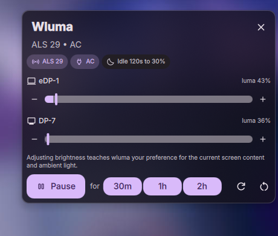

# DankWluma

A [DankMaterialShell](https://danklinux.com) plugin that surfaces and controls the
[wluma](https://github.com/maximbaz/wluma) adaptive-brightness daemon.



wluma learns how bright you want each display to be for a given screen content and ambient
light level, then keeps it there. This plugin shows what it is thinking and lets you steer it
without leaving the shell.

## Surfaces

- **Control Center tile** — icon, live brightness summary, and an expandable detail view.
  Clicking the icon tile pauses or resumes adaptation; clicking the body expands the detail.
- **DankBar pill** — always-visible brightness readout, greyed out while adaptation is paused.
  Clicking it opens the same panel as a popout.
- **Settings page** — output visibility, keyboard-backlight toggle, default pause duration,
  and the brightness write delay.

## What the panel shows

- Ambient light sensor reading, AC/battery, and the idle-dim configuration (or a warning when
  idle dimming is currently active).
- One row per managed output: type icon, name, screen-content luma, paused and dimmed badges,
  a brightness slider and ±5% buttons.
- Pause / Resume, timed pause (30m, 1h, 2h), refresh, and a daemon restart button.

## Behaviour worth knowing

**Changing brightness here also trains the predictor.** wluma treats every external brightness
write as a lesson for the current screen content and ambient light. That is the intended way to
teach it your preference, and the panel says so rather than pretending the slider is a plain
brightness control.

**Every write goes through the `wluma` CLI**, never directly to sysfs or DDC. Writing the
backlight behind wluma's back would change the hardware without teaching the predictor, which
is exactly the state this plugin exists to avoid.

**`dim` and `temperature` are deliberately absent.** wluma exposes them, but gamma control is
rejected under niri, so a UI for them would be a silent no-op.

## Requirements

- `wluma` 5.x on `PATH`, running as a systemd user unit (`systemctl --user status wluma`)
- DankMaterialShell >= 1.6.0

## Install

```sh
git clone <this-repo> ~/.config/DankMaterialShell/plugins/dankWluma
dms ipc call plugin-scan scan
dms ipc call plugins enable dankWluma
```

Then add the widget to the surfaces you want:

- **Control Center**: open it, enter edit mode (the pencil icon), and add "Wluma".
- **DankBar**: DMS Settings → the bar you want → add the `dankWluma` widget.

Editing the QML afterwards needs `dms ipc call plugins reload dankWluma`; editing
`plugin.json` needs `dms ipc call plugin-scan scan`.

## Architecture

```
plugin.json              manifest (permissions: process, settings_read, settings_write)
qmldir                   registers WlumaService as a plugin-local singleton
DankWluma.qml            PluginComponent: control-center tile, bar pills, popout
DankWlumaSettings.qml    settings page
WlumaPanel.qml           the panel body, shared by the detail view and the popout
OutputRow.qml            one output: badges, luma, slider, +/- buttons
WlumaChip.qml            small status pill (DMS ships no StatusChip)
services/WlumaService.qml  process lifecycle: status prime, watch stream, command queue
services/wluma.js        pure parsing / normalisation / argument building (unit-tested)
tests/wluma.test.mjs     bun test suite for wluma.js
```

`services/wluma.js` is deliberately Qt-free: all parsing, normalisation, output filtering and
command construction live there, so the logic is testable without a running shell. The QML
layer is process wiring and declarative bindings only.

The daemon has no D-Bus API, so the integration is:

- `wluma status --json` once at startup and after every reconnect — necessary because
  `watch` only emits on change and the widget would otherwise start blank;
- `wluma watch --json`, one complete status object per line, parsed through
  `Process { stdout: SplitParser }` and applied wholesale;
- `wluma set|pause|resume` through a single-flight command queue that coalesces brightness
  writes per output, so dragging a slider cannot fork a process per frame.

If the daemon dies, the stream is re-established with exponential backoff (1s doubling to a
30s cap) and the last snapshot is dropped, so a reconnect can never show stale values. A
missing `wluma` binary is reported as a distinct, terminal state instead of a retry loop.

## Tests

```sh
bun test
```

## Credits

- [wluma](https://github.com/maximbaz/wluma) by Maxim Baz — the daemon doing the actual
  work. Every brightness adaptation, prediction and training sample is its doing; this
  plugin is a window and a set of controls onto it.
- [DankClight](https://github.com/AvengeMedia/dms-plugins) by Avenge Media — the
  first-party Clight plugin this project studied as the reference for DMS plugin
  structure: the plugin-local singleton service registered through `qmldir`, the chip
  idiom (our `WlumaChip.qml` is adapted from its `StatusChip.qml`), and the PluginComponent
  surface wiring.
- [DankMaterialShell](https://github.com/AvengeMedia/DankMaterialShell) by Avenge Media —
  the shell and the plugin API this targets.

## License

MIT
